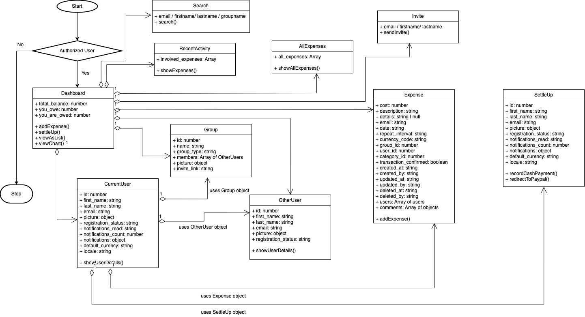

# Expense Tracker
A web application built with MERN stack for managing expenses.

## Project Description
This application covers the following functionalities :

1) Login and logout of application using token Authentication.
2) User can create, read or delete and Expense.
3)   User can filter expenses.
4)  Upload images of bills.
## API Calls

/user routes

* GET - http://localhost:3000/user - Fetch all users
* POST - http://localhost:3000/user - Create a new user
* DELETE - http://localhost:3000/user - Delete all users  

* GET - http://localhost:3000/user/:id - Get specific user by id
* PUT - http://localhost:3000/user/:id - Update specific user by id
* DELETE - http://localhost:3000/user/:id - Delete specific user

/expense routes

* GET - http://localhost:3000/expense - Fetch all expenses
* POST - http://localhost:3000/expense - Create a new expense
* DELETE - http://localhost:3000/expense - Delete all expenses

* GET - http://localhost:3000/expense/:id - Get specific expense by id
* PUT - http://localhost:3000/expense/:id - Update specific expense by id
* DELETE - http://localhost:3000/expense/:id - Delete specific expense

/report routes

* GET - http://localhost:3000/report - Fetch all reports
* POST - http://localhost:3000/report - Create a new report
* DELETE - http://localhost:3000/report - Delete all reports

* GET - http://localhost:3000/report/:id - Get specific report by id
* PUT - http://localhost:3000/report/:id - Update specific report by id
* DELETE - http://localhost:3000/report/:id - Delete specific report

miscellaneous routes:

* GET - http://localhost:3000/search - Get expense based on filters
* PUT - http://localhost:3000/mark-as-delete - Update expense as deleted

* GET - http://localhost:3000/grouped-user-data - Fetch grouped user data
* GET - http://localhost:3000//dashboard-data - Fetch dashboard
## Installation

1) Run command npm i on server and UI folders.
2) run tsc command to compile Typescript files on server.
## Domain Model

## Developed By

1) Rajat Rao, 002987057
2) Karthik Ananthnarayan, 002964104
3) Harshith Narahari, 002963745
4) Sri Harsha Peri, 002921346
## License

[MIT](https://choosealicense.com/licenses/mit/)

